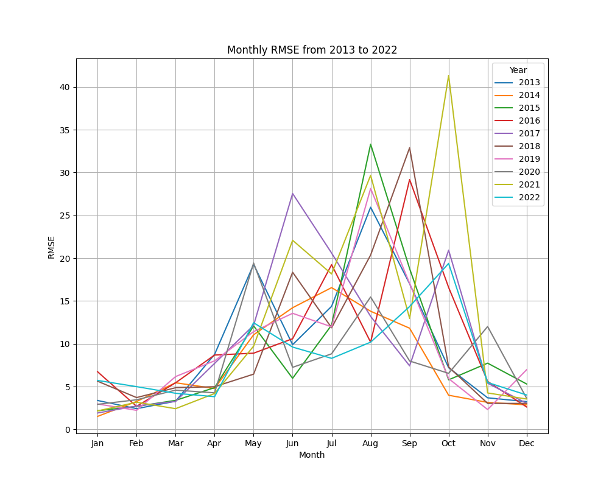

## Directory Structure
```
├── train.py
├── train.sh
├── inference.py
├── inference.sh
├── plot.py
├── plot.sh
├── MAE.py
├── figures/                  # Visualization directory
├── pred/                     # Contains nc files inferenced by model
├── src/
│   ├── losses.py             # Deep learning model structure
│   ├── models.py             # Model emulation functions
│   ├── prepare_data.py       # Other auxiliary functions
└── models/                   # Stores trained models
```
##  Parameter Description
In `train.sh`, the following key variables are defined:
- `train_start`: Start date for the training dataset (e.g., `1981-01-01`)
- `train_end`: End date for the training dataset (e.g., `2016-12-31`)
- `val_start`: Start date for the validation dataset (e.g., `2017-01-01`)
- `val_end`: End date for the validation dataset (e.g., `2021-12-31`)
- `test_start`: Start date for the test dataset (e.g., `2022-01-01`)
- `test_end`: End date for the test dataset (e.g., `2022-12-31`)
- `variables`: List of meteorological variables used for training (e.g., `w850 u200 u850 v200 v850 tp`)
- `x_data`: Path to the predictor dataset (input features)
- `y_data`:	Path to the predictand dataset (ground truth)
- `model_output`: Path where the trained model will be saved (`.h5` format)
- `terrain_data`: Path to terrain-related auxiliary data
- `kernel_size`: Convolutional kernel size (default:`5`)
- `initial_learning_rate`: Initial learning rate for training (default: `1e-3`)
- `terrain_enable`: Whether to use terrain data in training (`T` for True, `F` for False)
- `batch_size`: Training batch size (default: `64`)

In `inference.sh`, the following key variables are defined:
- `train_start`: Start date for the training dataset (e.g., 1981-01-01)
- `train_end`: End date for the training dataset (e.g., 2016-12-31)
- `val_start`: Start date for the validation dataset (e.g., 2017-01-01)
- `val_end`: End date for the validation dataset (e.g., 2021-12-31)
- `test_start`: Start date for the test dataset (e.g., 2013-01-01)
- `test_end`: End date for the test dataset (e.g., 2022-12-31)
- `variables`: List of meteorological variables used for inference (e.g., w850 u200 u850 v200 v850 tp)
- `x_data`: Path to the predictor dataset (input features)
- `y_data`: Path to the ground truth dataset (if available)
- `model_output`: Path to the trained model (.h5 file)
- `prediction_output`: Path where the generated predictions will be saved (.nc format)
- `batch_size`: Batch size for inference (default: 64)

In `plot.sh`, the following key variables are defined:
- `train_start`: Start date for the training dataset (e.g., 1981-01-01)
- `train_end`: End date for the training dataset (e.g., 2016-12-31)
- `val_start`: Start date for the validation dataset (e.g., 2017-01-01)
- `val_end`: End date for the validation dataset (e.g., 2021-12-31)
- `test_start`: Start date for the test dataset (e.g., 2013-01-01)
- `test_end`: End date for the test dataset (e.g., 2022-12-31)
- `variables`: List of meteorological variables used for visualization (e.g., w850 u200 u850 v200 v850 tp)
- `x_data`: Path to the predictor dataset (input features)
- `y_data`: Path to the ground truth dataset (observations)
- `mask_data`: Path to landmask data (for spatial filtering)
- `prediction_output`: Path to the model prediction output (.nc file)
- `avg_output`: Output path for the generated monthly average comparison figure
- `days_output`: Output path for the selected days' visualization
- `selected_days`: Specific dates for detailed visualization (e.g., 2022-10-15 2022-10-16 ... 2022-12-10)

## Results

## Results
- Evaluation metrics for prediction on 2022:
    |  | Corr | RMSE | MAE |
    |----------|----------|----------|----------|
    | RAINNC   |  0.638  |  9.77  | 3.56 |

**Running Scripts**:
Each script can be executed independently, depending on the stage of the project:
- `python train.py` to train the model.
- `python inference.py` to generate predictions.
- `python MAE.py` to calculate error metrics such as MAE and RMSE and generate figures.
- `python plot.py` for visualization given selected days.